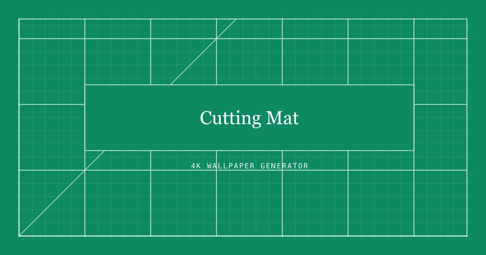

# Cutting Mat

**Draw your own cutting mat wallpapers in the browser.** Technical grids, numbered rulers, angle guides and procedurally simulated draped fabric — exported as PNG at up to 5120 × 1440.

**→ [cuttingmat.josemi.dev](https://cuttingmat.josemi.dev)**



---

## What it is

One HTML file. No build step, no bundler, no npm install, no backend. Open it by double-clicking and it works; drop it on any static host and it works there too. Every pixel is drawn locally with the Canvas 2D API, so no wallpaper is ever uploaded anywhere.

The hosted version counts page views with Vercel Web Analytics — cookieless, no personal data — via a single `<script>` tag that the deployment serves itself. Open the file locally and that request simply does not exist.

## Features

- **Backgrounds** — four presets, any custom color, or five gradients with an adjustable angle
- **Draped fabric** — a procedural textile simulation, not a blur filter (see below)
- **Grid** — lines or crosses, adjustable cell size and contrast
- **Technical details** — outer frame, numbered ruler with ticks, 45° diagonal, dashed angle guides, film grain
- **Knockout** — the grid is cut away behind each text block, snapped to the nearest major gridline
- **Text** — centered serif headline, vertical side label, paragraph in the bottom right
- **Shareable presets** — the full configuration is encoded in the URL
- **Six export formats** — 4K desktop, 16:10, 32:9 ultrawide, iPad, iPhone, 9:16 story

## How the fabric works

The folds are not a photo and not a blurred gradient. A low-resolution grayscale luminance map is generated with **value noise** and **fractional Brownian motion**, then scaled up — the browser's own interpolation is what makes the folds soft — and composited over the background in `soft-light` and `multiply`.

Noise is applied at three points: it bends each fold off its axis, varies the spacing so folds gather and open, and modulates brightness along a fold's length. The amplitude exponent is **1.24**; above 1 it widens the midtones, which is what makes the cloth read as falling rather than creased.

Three earlier approaches were tried and discarded, in case you are tempted:

| Approach | Why it failed |
| --- | --- |
| Blurred bands with rotated gradients | Reads as a generic drop shadow, not fabric |
| Pure sine waves | Perfectly periodic folds; reads as straight strokes |
| Amplitude exponent below 1 | Sharpens the crests into thin wrinkles instead of drape |

## Architecture

A single global `state` object and one `render(canvas, W, H)` function that draws the whole wallpaper at any resolution. The preview calls it on a 1500px-wide canvas; the download calls the same function on a temporary canvas at full resolution. That is why the exported PNG is identical to the preview, only larger.

Every measurement scales from `k = W / 3840`, using 4K as the reference. Any new pixel value has to be multiplied by `k` or the layout breaks when the format changes.

Drawing order inside `render` matters and should not be rearranged:

1. Background (solid or linear gradient)
2. Fabric texture, composited in `soft-light` + `multiply`
3. Measuring the text blocks — needed before the grid is drawn
4. Grid, angle guides and diagonal, all inside a single `clip('evenodd')`
5. Knockout borders, outer frame, numbered ruler
6. Grain, in `overlay`
7. Text: vertical side label, headline, paragraph

The cloth map is cached by `clothKey`. Without it, moving any slider recomputes the whole map and the UI stutters — so if you add a parameter that affects the fabric, add it to the key.

## Presets in the URL

Settings are serialized to the query string as they change, and only values that differ from the defaults are written — so the default configuration has a clean URL. Everything read back from the URL is validated: numbers are clamped to their slider range, colors must match a hex pattern, and anything unrecognized falls back to the default.

```
?p=-1&g=1&cl=62&f=3&t=Stay+Focused.
```

There is no `localStorage` and no server: the URL is the only place a configuration persists.

## Running it

```bash
open index.html
```

That is the whole setup. For the shareable-link feature to update the address bar you need an HTTP origin, since browsers block `history.replaceState` on `file://` — the copy button works either way because it builds the link itself.

```bash
python3 -m http.server 8000
```

## Deploying

Any static host. On Vercel it needs no configuration beyond the `vercel.json` in this repo, which only sets a couple of security headers and a cache policy for the preview image.

## Credit

Inspired by the **Cutting Mat Wallpaper Pack** by Rad Bali & Robert McCombe. The reference is visual only: this tool draws its own grids and does not contain or redistribute any of their files.
